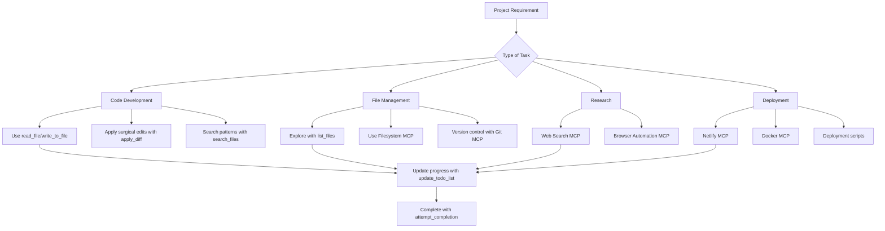

# Roo Skills and MCPs Research & Implementation Plan

## Project Context

You have multiple separate projects:

1. Remodeling website
2. Chatbot (multiple instances)
3. Audio enhancement app
4. Furnished apartment rental website
5. Botas rental website

**Tech Stack:** React, TypeScript, Tailwind CSS, Python backend, Supabase, Netlify

## Available Skills in Roo's Environment

### Core Development Skills

1. **File Operations**
   - `read_file`: Read files with line numbers for diffing
   - `write_to_file`: Create new files or complete rewrites
   - `apply_diff`: Make surgical edits to existing files
   - `list_files`: Explore directory structures

2. **Code Analysis & Search**
   - `search_files`: Regex search across files with context
   - File pattern filtering for targeted searches

3. **Project Management**
   - `update_todo_list`: Track progress with markdown checklists
   - Step-by-step task tracking with status updates

4. **Mode Management**
   - `switch_mode`: Transition between different operational modes
   - `new_task`: Create new task instances in specific modes

5. **Communication & Planning**
   - `ask_followup_question`: Gather clarification with suggested answers
   - `attempt_completion`: Finalize tasks and present results

### Specialized Skills

1. **create-mcp-server**: Build custom MCP servers
2. **create-mode**: Develop custom operational modes

## Available MCPs (Model Context Protocol Servers)

### Official Anthropic MCPs

1. **Filesystem MCP**
   - **When to use**: File browsing, reading, writing operations
   - **Pros**: Native integration, reliable, supports large files

2. **Git MCP**
   - **When to use**: Version control operations, commit history, branching
   - **Pros**: Direct git integration, supports common workflows

3. **SQLite MCP**
   - **When to use**: Database operations, query execution, schema management
   - **Pros**: Lightweight, no external dependencies

### Community MCPs

1. **Web Search MCP**
   - **When to use**: Research, fact-checking, information gathering
   - **Pros**: Real-time information, multiple search engines

2. **Browser Automation MCP**
   - **When to use**: Web scraping, testing, automation tasks
   - **Pros**: Headless browsing, screenshot capabilities

3. **Calendar MCP**
   - **When to use**: Schedule management, event creation
   - **Pros**: Google Calendar integration, recurring events

4. **Email MCP**
   - **When to use**: Email automation, notification systems
   - **Pros**: SMTP support, attachment handling

5. **Weather MCP**
   - **When to use**: Location-based weather data
   - **Pros**: Multiple providers, forecast data

### Development-Focused MCPs

1. **Docker MCP**
   - **When to use**: Container management, image building
   - **Pros**: Full Docker API coverage

2. **Kubernetes MCP**
   - **When to use**: Cluster management, deployment orchestration
   - **Pros**: Production-grade container management

3. **AWS MCP**
   - **When to use**: Cloud infrastructure management
   - **Pros**: Multiple service integrations

4. **GitHub MCP**
   - **When to use**: Repository management, PR reviews, issues
   - **Pros**: Full GitHub API access

## Project Requirements Analysis

### Common Needs Across Projects

1. **Frontend Development**
   - React component creation
   - TypeScript type definitions
   - Tailwind CSS styling
   - Responsive design implementation

2. **Backend Development**
   - Python API development
   - Database schema design
   - Authentication systems
   - File upload handling

3. **Database Operations**
   - Supabase integration
   - Real-time subscriptions
   - Row-level security
   - Migration management

4. **Deployment & DevOps**
   - Netlify deployment
   - Environment configuration
   - CI/CD pipeline setup
   - Monitoring and logging

### Project-Specific Needs

1. **Remodeling Website**
   - Image gallery management
   - Project portfolio display
   - Contact form handling
   - Service pricing calculators

2. **Chatbots**
   - Natural language processing
   - Conversation state management
   - Integration with external APIs
   - User authentication

3. **Audio Enhancement App**
   - Audio file processing
   - Real-time audio manipulation
   - Audio visualization
   - Export functionality

4. **Rental Websites**
   - Property listing management
   - Booking system
   - Payment processing
   - Calendar availability

## Tools-to-Needs Mapping

### Essential Tools for Your Stack

1. **React/TypeScript Development**
   - File operations for component creation
   - Search for component references
   - Diff editing for refactoring

2. **Python Backend**
   - API endpoint creation
   - Database model definitions
   - Error handling implementation

3. **Supabase Integration**
   - Database schema management
   - Authentication flow implementation
   - Real-time subscription setup

4. **Netlify Deployment**
   - Configuration file management
   - Build process optimization
   - Environment variable setup

## Global Tools Directory Structure

```
C:/Users/david/Desktop/global_tools/
├── skills/
│   ├── frontend/
│   │   ├── react_components/
│   │   ├── typescript_utils/
│   │   └── tailwind_templates/
│   ├── backend/
│   │   ├── python_apis/
│   │   ├── database_models/
│   │   └── authentication/
│   ├── deployment/
│   │   ├── netlify_configs/
│   │   ├── docker_files/
│   │   └── ci_cd_scripts/
│   └── project_templates/
│       ├── remodeling_website/
│       ├── chatbot/
│       ├── audio_app/
│       └── rental_website/
├── mcps/
│   ├── installed/
│   │   ├── filesystem/
│   │   ├── git/
│   │   └── sqlite/
│   ├── custom/
│   │   ├── supabase_mcp/
│   │   ├── netlify_mcp/
│   │   └── audio_processing_mcp/
│   └── configuration/
│       ├── claude_desktop_config.json
│       └── mcp_settings.json
└── documentation/
    ├── skill_usage_guides/
    ├── mcp_integration_guides/
    └── project_setup_checklists/
```

## When to Use Each Tool & Pros

### Roo Native Skills

| Skill                   | When to Use                            | Pros                                                       |
| ----------------------- | -------------------------------------- | ---------------------------------------------------------- |
| `read_file`             | Understanding existing code, debugging | Line numbers for precise reference, multiple reading modes |
| `write_to_file`         | Creating new files, complete rewrites  | Automatic directory creation, complete file control        |
| `apply_diff`            | Making targeted code changes           | Surgical precision, preserves surrounding code             |
| `search_files`          | Finding patterns, refactoring          | Regex support, context-rich results                        |
| `list_files`            | Exploring project structure            | Recursive option, quick overview                           |
| `update_todo_list`      | Project management, task tracking      | Visual progress, easy status updates                       |
| `ask_followup_question` | Gathering requirements                 | Suggested answers reduce typing                            |
| `switch_mode`           | Changing operational focus             | Seamless transitions between specialties                   |

### MCP Servers

| MCP                       | When to Use                          | Pros                                      |
| ------------------------- | ------------------------------------ | ----------------------------------------- |
| **Filesystem MCP**        | File operations across projects      | Unified interface, large file support     |
| **Git MCP**               | Version control across all projects  | Branch management, commit history         |
| **SQLite MCP**            | Lightweight database needs           | No server required, simple setup          |
| **Web Search MCP**        | Research for all projects            | Real-time information, multiple sources   |
| **Browser Automation**    | Testing web applications             | Headless operation, screenshot capability |
| **Supabase MCP** (custom) | Database operations for rental sites | Direct Supabase API access                |
| **Netlify MCP** (custom)  | Deployment management                | Automated deployments, status checks      |

## Implementation Strategy

### Phase 1: Foundation Setup

1. Create global tools directory structure
2. Install essential MCPs (Filesystem, Git, SQLite)
3. Create basic skill templates for React/TypeScript/Python

### Phase 2: Project-Specific Tools

1. Develop custom MCPs for Supabase and Netlify
2. Create project templates for each project type
3. Build reusable components and utilities

### Phase 3: Integration & Automation

1. Set up cross-project tool sharing
2. Create automation scripts for common tasks
3. Develop monitoring and reporting tools

### Phase 4: Optimization & Scaling

1. Performance optimization of tools
2. Documentation completion
3. Training and onboarding materials

## Next Steps

1. **Review this plan** - Check if it aligns with your needs
2. **Prioritize implementation** - Start with most critical tools
3. **Begin with Phase 1** - Set up the foundation
4. **Iterate based on feedback** - Refine as you use the tools

## Mermaid Diagram: Tool Usage Workflow



## Recommendations

1. **Start with native skills** - They're always available and reliable
2. **Add MCPs gradually** - Begin with Filesystem and Git MCPs
3. **Create custom MCPs for frequent tasks** - Supabase/Netlify integration
4. **Maintain documentation** - Keep usage guides updated
5. **Regularly review tool effectiveness** - Remove unused tools, add new ones as needed

This plan provides a comprehensive framework for leveraging Roo's capabilities across all your projects. The global tools directory will serve as a centralized repository for reusable components, configurations, and documentation.
